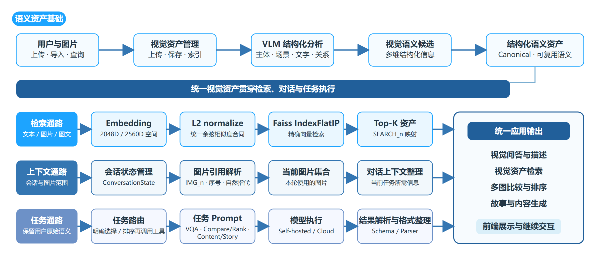
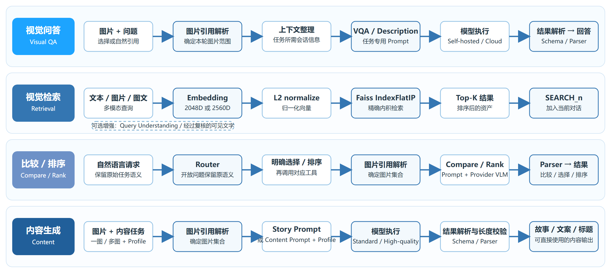
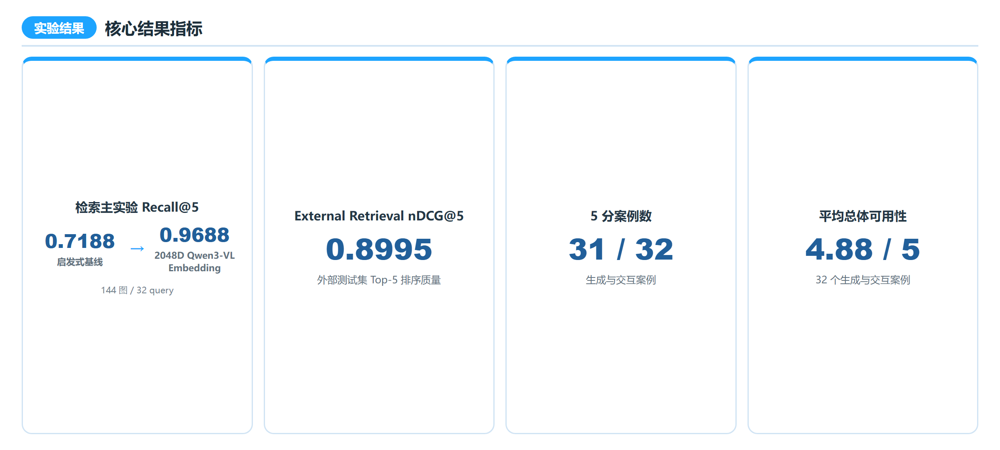
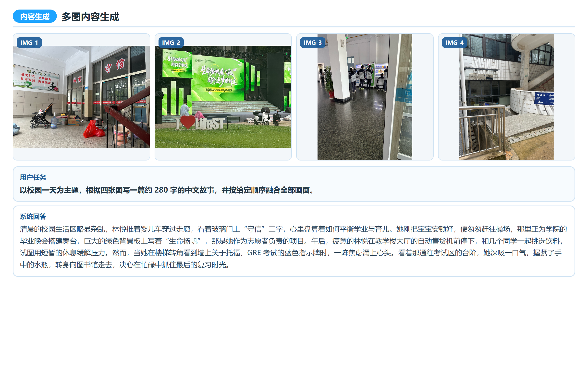
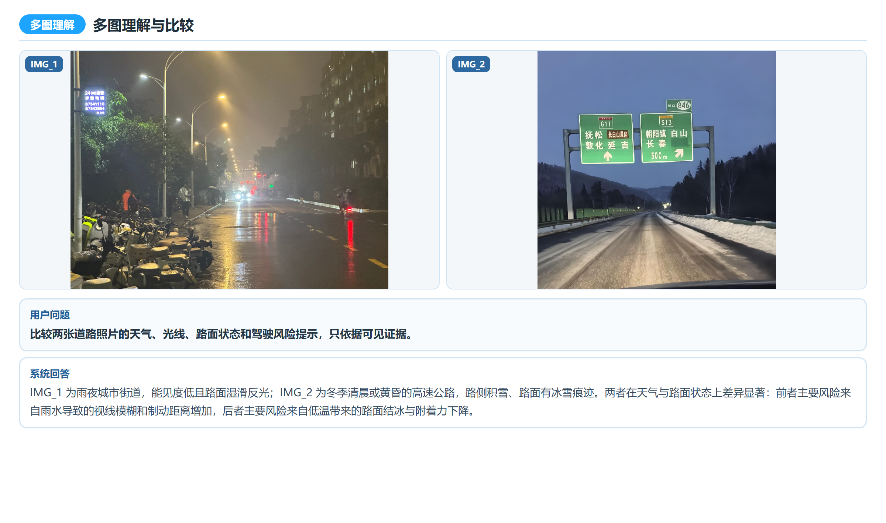
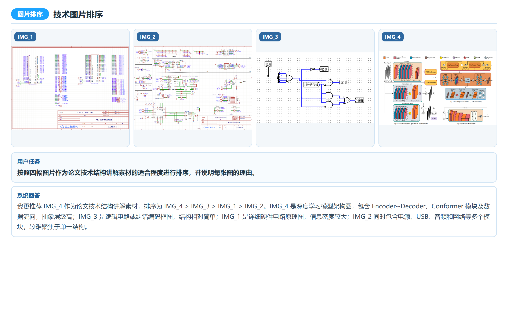
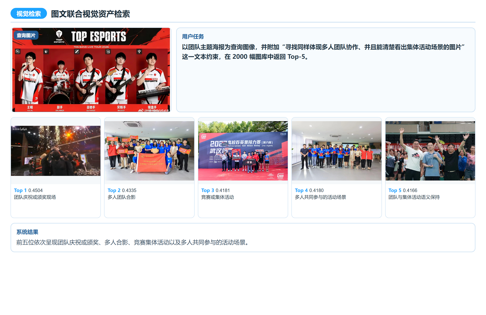
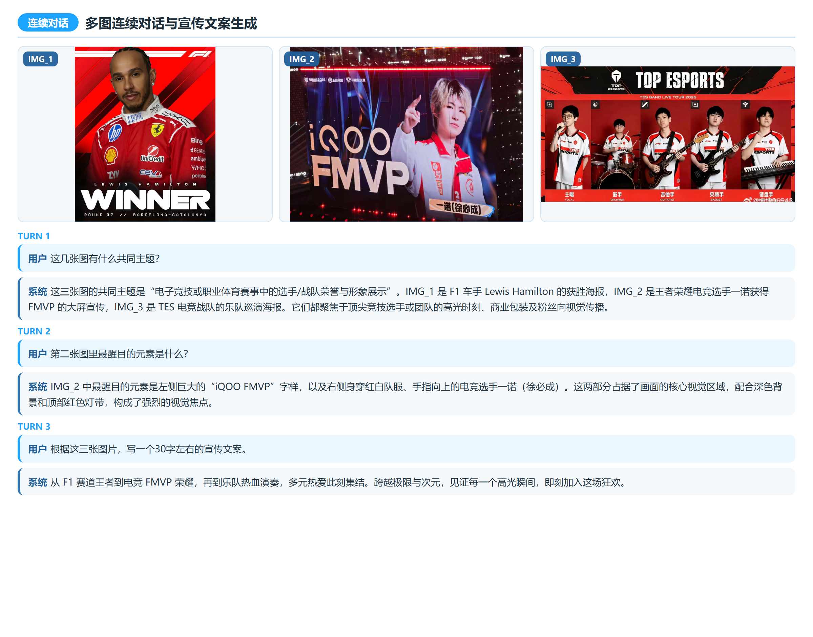
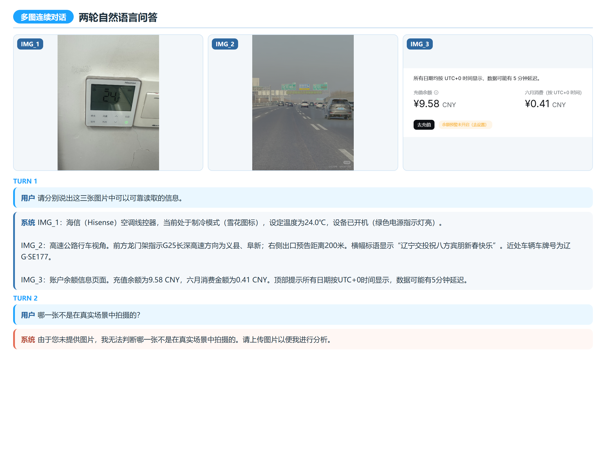

# 视觉与自然语言处理课程项目｜SceneMind-X 多模态视觉资产系统

> **脱敏说明：本公开版本已移除课程提供的训练集与验证集图片，仅保留可公开的数据与项目工程内容。**

## 中文版

### 1. 本项目主要实现

#### 1.1 三种模型接入方式

> **推荐：Cloud API（阿里云百炼）**

1. **Cloud API（推荐）**：接入阿里云百炼云端 VLM 与多模态 Embedding；无需本地 GPU，也无需下载大型模型权重，是课程评阅与演示的首选方式。
2. **Local（可选）**：在本机直接加载 VLM 与 Multimodal Embedding，适合具备足够 NVIDIA GPU、CUDA/PyTorch 和本地权重的使用者。
3. **Self-hosted（高级可选）**：接入使用者自行部署的远端 GPU 模型服务，适合已有安全私网或 SSH tunnel 运行环境的场景。

#### 1.2 五类主要功能

1. **视觉资产与结构化视觉分析**：图片导入、视觉资产管理，以及 Canonical/结构化视觉语义组织。
2. **多图持续对话与视觉问答**：单图/多图 VQA、跨轮上下文、稳定图片引用与会话状态管理。
3. **多图内容生成**：客观描述、朋友圈、新闻图注、广告、故事等多种内容类型。
4. **多模态视觉检索**：文搜图、图搜图、图文联合检索与 Faiss Top-K。
5. **Compare / Select / Rank**：多图开放比较、按条件选择与完整排序。

### 2. 项目文件结构

```text
SceneMind-X/
├─ apps/                 # FastAPI API 入口与 WebUI 前端资源
├─ configs/              # Provider、模型与运行配置
├─ data/                 # Canonical、索引、Manifest、Schema 与运行数据
├─ datasets/             # Train/Validation 空占位目录与 External Stress 公开图片
├─ docs/                 # 部署文档、图片资源与包级 metadata
├─ models/               # Local 模型权重放置说明
├─ prompts/              # 生产 Prompt、Schema 关联模板与 Profile 配置
├─ runtime/              # 启动后的产品状态、日志与用户数据
├─ scripts/              # Windows / PowerShell 启动与进程辅助脚本
├─ src/                  # SceneMind-X 核心业务代码
├─ vendor/               # Local / Self-hosted Embedding 固定上游源码
├─ .secrets/             # Cloud Provider 凭据（敏感）
├─ README.md
├─ start_scenemindx.bat
├─ pyproject.toml
└─ requirements*.txt
```

### 3. 推荐 Cloud API 部署与运行环境

#### 推荐的 Cloud API 模式

- Windows 10/11 x64；
- Python 3.11 或更高版本（课程副本已用 CPython 3.13.9 验证）；
- 8 GB 以上内存，推荐 16 GB；
- Edge 或 Chrome；
- 可访问阿里云百炼/DashScope 的网络；
- 解压课程包后额外预留约 4 GB 可写空间；
- 不要求 NVIDIA GPU，也不需要下载大模型权重。

在项目根目录安装基础依赖：

```powershell
python -m pip install -r requirements.txt
```

这是视觉与自然语言处理课程评阅和演示的推荐部署方式：不需要下载本地大模型，不要求本地 GPU，最容易复现。系统使用阿里云百炼 `qwen3.6-flash`、`qwen3.7-plus` 和 2560D `qwen3-vl-embedding`。请按 [Cloud API 部署说明](docs/DEPLOYMENT_CLOUD.md) 配置自己的 API Key。启动后在模型接入面板选择“百炼云端模型”，测试 VLM 与 Embedding 并保存选择。

Local 模式额外需要 NVIDIA GPU、CUDA/PyTorch 和自行下载的模型权重；Self-hosted 模式需要使用者自行部署远端兼容服务。三种模式的硬件条件互不等同。

### 4. 快速启动 / Quick Start

#### 4.1 推荐方式：双击 `start_scenemindx.bat`

1. 完整解压 `SceneMind-X`，不要拆散目录，也不要移动根目录中的 BAT。
2. 首次使用先按第 3 节安装依赖并确认 Cloud 凭据。
3. 双击项目根目录的 `start_scenemindx.bat`。
4. 启动窗口会依次检查课程包文件、端口与已有服务、Python 与依赖，随后启动后端并轮询真实健康接口。
5. 看到“`SceneMind-X is ready`”后，默认浏览器会自动打开。
6. 默认地址为 [http://127.0.0.1:8765](http://127.0.0.1:8765)。浏览器未自动打开时手动访问该地址。
7. 保持启动窗口打开，以便查看错误和关闭服务。

#### 4.2 命令行启动

如果 BAT 被系统策略阻止，或希望使用 PowerShell，请先进入解压后的 `SceneMind-X` 项目根目录，再执行：

```powershell
powershell.exe -NoLogo -NoProfile -ExecutionPolicy Bypass -File .\scripts\start_scenemindx.ps1
```

可用 `-Port 8766` 指定其他端口，用 `-NoBrowser` 禁止自动打开浏览器。命令行启动与 BAT 使用同一套真实健康检查。

#### 4.3 启动成功的判断

启动器只有在 `http://127.0.0.1:8765/health/live` 返回 `status=ok` 且 `liveness=alive` 后才显示 Ready。Ready 表示本地 API/WebUI 已存活；进入页面后仍需确认当前 Provider 的 VLM、Embedding 和索引状态。

#### 4.4 如何关闭

由本次启动器新建的服务会与启动窗口保持关联。回到启动窗口，按 **Enter** 或 **Ctrl+C**，启动器会停止它创建的后端进程。不要直接结束未知 Python 进程。如果启动器发现 8765 上已有健康的 SceneMind-X，它只会打开浏览器，不会接管或停止原有服务。

### 5. 项目简介

SceneMind-X 是“视觉与自然语言处理”课程项目，面向照片、截图、海报、课程材料和技术图等混合视觉资产，在一套应用中连接图片导入、结构化视觉分析、Canonical 语义资产、多模态检索、多图连续交互、比较排序和内容生成。

系统直接复用参数保持冻结的预训练视觉语言模型和多模态表示模型，重点研究图片身份管理、跨轮引用、多图上下文、任务专用 Prompt/Schema/Parser、Provider 切换与可恢复 Faiss 索引。课程提交工程包含程序、数据、索引、Prompt 与配置，可独立运行，不需要原开发目录。

### 6. 系统总体架构

浏览器中的 WebUI 通过 FastAPI API 调用应用服务。资产层维护图片身份、图库、Canonical 与当前会话状态；ConversationState、Reference Resolver 和当前图片范围负责多图上下文。任务专用 Prompt、Schema 与 Parser 组织输入输出，再由当前 Provider 接入 VLM 和多模态 Embedding。Embedding 与 Faiss 支持图搜图、文搜图和图文联合检索，最终形成 VQA、Retrieval、Compare、Rank 与 Content Generation 等输出。



视觉资产进入系统后，先形成结构化视觉理解和可复用语义信息。任务路由保留普通自然语言请求的原始语义，只将明确的选择、排序或生成操作交给对应任务链；Provider 层则把同一应用接口映射到 Cloud、Local 或 Self-hosted 模型能力。



### 7. 第一次打开系统

左侧五个主入口为“多模态对话”“多图生成”“图像检索”“比较排序”“图片库”。首次使用建议按以下顺序：

1. 打开顶部模型接入区域；
2. 选择“百炼云端模型”“云端标准 · qwen3.6-flash”和“使用自己的阿里云百炼 API Key”；
3. 点击“测试 VLM 与 Embedding”，再点击“保存接入选择”；
4. 点击“刷新连接状态”；
5. VLM 与 Embedding 均为 Ready 后，在 Default Library 选择一张公开图片加入工作区并开始提问。


### 8. 数据与随包资源

公开版保留经批准公开的数据与工程资源：

| 数据集 | 目录 | 规模 | 用途 |
|---|---|---:|---|
| Course Train | `datasets/course_train/` | 0（仅保留空目录） | 历史课程实验使用 2000 张，原图不包含在公开版中 |
| Course Validation | `datasets/course_val/` | 0（仅保留空目录） | 历史课程实验使用 369 张，原图不包含在公开版中 |
| External Stress Set v1 | `datasets/external_stress/` | 96 张（46 JPG、42 PNG、8 HEIC），189,761,058 字节 | 域外可用性、失败边界和定性案例 |
| Default Library | `data/user_assets/` | 88 张 | 可公开的默认视觉资产、Canonical 与 Cloud 索引 |
| 用户自定义图库 | `runtime/` 启动后创建 | 由使用者决定 | 持久导入、Canonical 与当前 Provider 索引 |

公开版完整保留 External Stress 与 Default Library。课程提供的 Train/Validation 原图、缩略图、资产 membership 和对应向量索引已移除；系统 Train/Validation 图库仍保留为只读空图库。纯文本 Canonical 历史结果作为结构化研究记录保留，不包含图像载荷，也不构成公开运行时的图库 membership。

公开版 Cloud `qwen3-vl-embedding` 2560D IndexFlatIP 仅保留 88 项 Default Library overlay；Train/Validation 基础索引与 Local/Self-hosted 2048D 系统索引均为空。两类向量空间仍不可混用。

### 9. 模型接入与三种部署方式

#### 9.1 Cloud API（推荐）

这是推荐方案，配置最简单，不需要本地模型和 GPU。系统使用阿里云百炼/DashScope 的 `qwen3.6-flash`、`qwen3.7-plus` 和 `qwen3-vl-embedding`（2560D）。公开仓库不包含任何真实凭据；使用者需要配置自己的 API Key。

完整配置见 [Cloud API 部署](docs/DEPLOYMENT_CLOUD.md)。

#### 9.2 Local（有 GPU 时可选）

Local 在本机按需加载 `Qwen3-VL-4B-Instruct` 与 `Qwen3-VL-Embedding-2B`（2048D）。课程包不包含权重，使用者需要自行准备显卡、CUDA/PyTorch、Local 扩展依赖和模型文件。低显存设备适合按需加载单一能力，不建议强制双模型常驻。

完整配置、官方下载来源和准确权重目录见 [Local 部署](docs/DEPLOYMENT_LOCAL.md)。

#### 9.3 Self-hosted Server（高级可选）

Self-hosted 适合已经拥有 GPU Linux 服务器、并希望把远端 VLM 与 Embedding 接入 SceneMind-X 的使用者。课程包保留客户端接入能力，但不附带私人服务器 runtime；远端兼容服务由使用者自行部署。本机可通过受控私网或 SSH tunnel 连接，普通 Cloud 用户不需要服务器。

通用 API 合同、安全连接与 Ready 检查见 [Self-hosted 部署](docs/DEPLOYMENT_SELF_HOSTED.md)。

### 10. Provider 与模型状态

顶部接入面板统一管理 Cloud、Local 和 Self-hosted：

- “刷新”重新读取页面状态；
- “刷新连接状态”执行一次受控重连/检查，不持续付费轮询；
- “测试 VLM 与 Embedding”在 Cloud 模式分别执行一次最小能力检查；
- “检查云索引状态”检查 2560D Cloud 基础索引和用户 overlay；
- “检查本机环境”“开始按需加载”“卸载本地模型”只用于 Local；
- “重新检查服务器连接”只用于 Self-hosted；
- “保存接入选择”提交模式、档位和凭据来源。

Cloud Standard 适合普通任务；High-quality 适合复杂多图、技术图片和长内容。切换 VLM 不改变资产身份，但切换 Embedding 空间后，自定义资产可能需要为目标空间补齐向量。


### 11. 视觉资产库与图片导入

系统 Train 和 Validation 图库为只读固定图库；公开版中两者均为空。点击 `＋` 创建自定义图库，使用 `✎` 重命名、`−` 删除；删除图库或资产前应确认当前选择。

上传前选择“本地图片用途”：

- “仅临时用于当前会话”：图片可用于对话、生成、检索查询和比较，但不会进入持久图库；
- “保存到当前自定义图片库”：图片复制到课程副本的受管存储，可生成 Canonical，并进入当前 Provider 对应索引。

选择图片后点击“加入当前工作区”。详情区提供“生成 Canonical 标注”“为当前图片建立索引”“移动”和“移除”；临时图片也可在后续明确保存到自定义图库。


### 12. 结构化视觉分析

系统可将主体、场景、活动、关系和可见文字等信息整理为结构化视觉候选，并进一步形成可复用的 Canonical 语义资产。Canonical 不是人工 Gold，也不是模型训练标签；它主要用于资产详情展示、检索元数据和受控 Prompt 上下文。在视觉问答、比较和排序的常规模型输出不可用且有界修复仍失败时，经过筛选的安全事实还可支持保守输出；内容生成只把这些事实作为上下文。

### 13. 多图连续对话与视觉问答

从图库选择图片后点击“加入当前工作区”，再进入“多模态对话”。系统按稳定顺序建立 `IMG_1`、`IMG_2` 等绑定，也支持 `SEARCH_n`、序号和“这张”“上一张”“刚才那张”等自然指代。服务端负责解析真实图片范围、focus、lock、最近引用和 task frame，VLM 负责理解问题和回答；多张图片均可能被指代时，系统会进行一次必要澄清。已删除、越域或跨会话资产会被拒绝。


### 14. 内容生成

进入“多图生成”，使用“添加当前选中”或“从当前 Chat 导入”加入图片。内容类型包括自动识别、客观描述、朋友圈、旅行日记、新闻图注、广告文案、海报标题、诗歌、故事创作和普通文章；目标长度为 10–1000，并可按输入顺序、重要性、有证据时的时间顺序或独立画面组织。故事类任务允许有边界的创作，客观描述优先保留可见事实和不确定性。


### 15. 多模态视觉检索

“图像检索”支持文本、图片以及图片加自然语言约束。范围可选当前图库、Train、Validation 或全部图库；Top-K 固定为 5，默认排除查询图片本身。结果由当前 Embedding 空间和对应 Faiss 索引产生，可作为 `SEARCH_1`–`SEARCH_5` 加入当前对话继续询问。


### 16. Compare / Select / Rank

对 2–5 张图片进行开放式差异分析时，直接在 Chat 中保留用户原始问题。只有用户明确要求选择最好若干张或完整排序时，才进入“选择最佳 / Top K”或“完整排序”；选择数量为 1–5，且不能超过输入图片数。后端检查图片范围、数量和参数合法性，VLM 完成语义比较和理由生成。


### 17. Embedding 与索引维护

持久资产若尚无当前 Provider 的向量，页面会显示待补齐状态。可使用“为当前图片建立索引”“补齐当前图库索引”或“补齐全部自定义资产”；运行中的任务可以取消。Backfill 只补齐目标空间中的缺失项，不会把 Cloud 2560D 与 Local/Self-hosted 2048D 向量混用。公开版 Train/Validation Cloud 基础索引应显示 0 项，Default Library overlay 保留 88 项。

### 18. 自定义图库、历史与导出

自定义图库支持创建、重命名、移动资产和显式删除。历史区域可点击“刷新”；“导出 JSON”提供结构化会话记录。导出可能包含使用者自己的图片文件名或对话内容，分享前应自行检查。推荐首次体验顺序为：单图 VQA → 双图开放比较 → 多图内容生成 → 图文联合检索 → `SEARCH_n` 回流 Chat → 临时图片持久化与 Backfill。

### 19. 系统架构与实现细节

- 任务专用 Prompt、Schema 与 Parser 分别组织 VQA、描述、比较、排序和内容生成；
- ConversationState、Reference Resolver、Current Image Scope 和 Session Ledger 维护多图状态；
- 检索采用 L2 归一化向量与 Faiss `IndexFlatIP`；
- Cloud 使用 `qwen3.6-flash` / `qwen3.7-plus` 和 `qwen3-vl-embedding` 2560D；
- Local/Self-hosted 使用 `Qwen3-VL-4B-Instruct` 和 `Qwen3-VL-Embedding-2B` 2048D；
- Provider 的 VLM、Embedding 和 Retrieval readiness 分开显示，索引在临时离线时仍可保留；
- 基础模型参数保持冻结，当前系统没有执行全量微调或 QLoRA。
- `vendor/qwen3_vl_embedding_frozen/` 保留 Qwen3-VL-Embedding 上游 commit `393e2978d27852b0d0230d6994f37f9c15bed73c` 的固定源码，按 Apache-2.0 使用，许可证位于该目录的 `LICENSE`。

### 20. 实验结果



- 144 图/32 query 主检索实验：启发式基线 Recall@5 为 0.7188，2048D Qwen3-VL Embedding 为 0.9688；
- External Retrieval nDCG@5 为 0.8995；
- 32 个生成与交互案例中，31 个获得 5 分人工任务完成度/总体可用性评价，平均为 4.88/5。该分数反映任务基本完成和实际可用性，不是事实准确率。

### 21. 示例案例

以下五张图分别展示多图内容生成、多图理解与比较、技术图片排序、图文联合检索和多图连续对话：











已知 Failure Case 表明：第一轮能够理解三张图片，但后续高度省略式问题没有稳定继承完整图片集合。显式 `IMG_n`、序号引用或“刚才这三张图片”等集合表达更稳定。



### 22. 常见问题与排错

- **双击 BAT 后报错或立即退出**：窗口会保留错误。确认 `scripts/start_scenemindx.ps1` 存在、Python 可用，并运行 `python -m pip install -r requirements.txt`。也可设置 `$env:SCENEMINDX_PYTHON='完整的 python.exe 路径'`。
- **端口 8765 被占用**：先访问 `http://127.0.0.1:8765/health/live`。若不是健康的 SceneMind-X，关闭占用程序或使用 `-Port 8766`；启动器不会停止未知进程。
- **浏览器未打开**：手动访问 `http://127.0.0.1:8765`，并检查 `runtime/logs/` 下最新 stdout/stderr。
- **Cloud 显示 invalid key、permission 或 billing**：确认 Key 未过期、百炼已开通、账户额度和模型权限可用，地域为 `cn-beijing`。课程 Key 计划于 2026-09-30 停用。
- **VLM Ready 但 Embedding 不 Ready**：二者是独立能力；检查 `qwen3-vl-embedding` 权限、2560D 状态和云索引。
- **检索无结果或少于 5 条**：检查范围、active 资产、查询图排除选项和当前 Provider 的索引覆盖；自定义资产可执行 Backfill。
- **导入后找不到图片**：确认上传时选择的是会话临时资产还是持久自定义图库；临时图不会跨会话出现。
- **多图问题要求澄清**：使用 `IMG_n`、序号或明确集合表达，避免跨多轮只说“这组图”。
- **Local preflight 失败或 OOM**：检查权重、Local extra 依赖、CUDA/PyTorch 和显存；8 GiB 设备优先单能力按需加载或使用 Cloud。
- **Self-hosted 连接失败**：先检查服务器本机 VLM/E1，再检查私有隧道；不要开放公网推理端口。
- **HEIC 无法预览**：External Stress 保留 8 张 HEIC 原图；需要兼容转换时创建副本，不覆盖原图。

### 23. 文件与目录说明

第 3 节给出所有主要目录的人工可读用途。公开发布文件的逐文件机器记录位于 [`docs/package_metadata/file_manifest_sha256.jsonl`](docs/package_metadata/file_manifest_sha256.jsonl)，每条记录包含相对路径、字节数和 SHA-256；凭据、运行态、缓存和清单文件本身不进入记录。数据图片、索引、缩略图和项目文档资源均可逐项核对。

### 24. 已知限制

- Local 双模型完整常驻需要较高显存；模型权重不随课程包分发；
- Self-hosted 需要使用者自行部署兼容远端服务并建立安全连接；
- 多轮多图对话对明确集合引用更稳定，高度省略的完整集合继承仍有边界；
- Cloud API 能力受使用者账户额度、地域和模型权限影响；
- External Stress 中 8 张 HEIC 的浏览器兼容性取决于操作系统；
- Ready 只代表本地 Web 服务存活，模型能力仍应以 Provider 面板的 VLM、Embedding 与 Retrieval 状态为准。

---

## English Version

> **Data Notice:** The course-provided training and validation images have been removed from this public release. Only data approved for public release and the project implementation are included.

### 1. What the Project Implements

#### 1.1 Three model-access modes

> **Recommended: Cloud API (Alibaba Cloud Model Studio)**

1. **Cloud API (recommended)**: uses cloud VLM and multimodal Embedding services without a local GPU or large model downloads; this is the preferred path for course review and demonstration.
2. **Local (optional)**: loads the VLM and Multimodal Embedding directly on the computer; it requires a suitable NVIDIA GPU, CUDA/PyTorch, and locally prepared weights.
3. **Self-hosted (advanced optional)**: connects to user-deployed remote GPU model services through a controlled private network or SSH tunnel.

#### 1.2 Five main capability groups

1. **Visual assets and structured visual analysis**: image import, asset management, and Canonical/structured visual semantics.
2. **Continuous multi-image chat and VQA**: single-/multi-image VQA, cross-turn context, stable image references, and conversation state.
3. **Multi-image content generation**: objective descriptions, Moments posts, news captions, advertisements, stories, and other profiles.
4. **Multimodal visual retrieval**: text-to-image, image-to-image, joint image-text retrieval, and Faiss Top-K.
5. **Compare / Select / Rank**: open comparison, condition-based selection, and full ranking across images.

### 2. Project Directory Structure

```text
SceneMind-X/
├─ apps/                 # FastAPI entry point and WebUI assets
├─ configs/              # Provider, model, and runtime configuration
├─ data/                 # Canonical data, indexes, manifests, schemas, and runtime data
├─ datasets/             # Empty Train/Validation placeholders and public External Stress images
├─ docs/                 # Deployment documents, visual assets, and package metadata
├─ models/               # Placement guidance for Local model weights
├─ prompts/              # Production Prompts, Schema-linked templates, and Profiles
├─ runtime/              # Product state, logs, and user data created at runtime
├─ scripts/              # Windows / PowerShell launch and process helpers
├─ src/                  # Core SceneMind-X application code
├─ vendor/               # Frozen upstream source for Local / Self-hosted Embedding
├─ .secrets/             # Cloud Provider credentials (sensitive)
├─ README.md
├─ start_scenemindx.bat
├─ pyproject.toml
└─ requirements*.txt
```

### 3. Recommended Cloud API deployment and environment

#### Recommended Cloud API mode

- Windows 10/11 x64;
- Python 3.11 or later (validated with CPython 3.13.9);
- at least 8 GB RAM, with 16 GB recommended;
- Edge or Chrome;
- network access to Alibaba Cloud Model Studio/DashScope;
- about 4 GB of writable space in addition to the extracted package;
- no NVIDIA GPU and no local model download required.

Install the base dependencies from the project root:

```powershell
python -m pip install -r requirements.txt
```

This is the recommended path for grading and demonstrating the Visual and Natural Language Processing course project: no local model download or NVIDIA GPU is required, and it is the simplest reproduction route. SceneMind-X uses Alibaba Cloud Model Studio `qwen3.6-flash`, `qwen3.7-plus`, and 2560D `qwen3-vl-embedding`. Configure your own API key through [Cloud API deployment](docs/DEPLOYMENT_CLOUD.md), then test VLM and Embedding in model access and save the Cloud selection.

Local mode additionally requires an NVIDIA GPU, CUDA/PyTorch, and downloaded weights. Self-hosted mode requires a user-deployed compatible remote service. The three modes do not share the same hardware requirements.

### 4. Quick Start

#### 4.1 Recommended: double-click `start_scenemindx.bat`

1. Extract the complete `SceneMind-X` folder without separating its contents or moving the BAT out of the root.
2. Install dependencies and confirm Cloud credentials as described in Section 3.
3. Double-click `start_scenemindx.bat` in the project root.
4. The launcher checks package files, the port and existing service, Python and dependencies, then starts the backend and polls the real health endpoint.
5. The default browser opens only after `SceneMind-X is ready` appears.
6. The default URL is [http://127.0.0.1:8765](http://127.0.0.1:8765). Open it manually if the browser does not start.
7. Keep the launcher window open for errors and shutdown control.

#### 4.2 Command-line launch

If BAT execution is blocked by policy or you prefer PowerShell, enter the extracted `SceneMind-X` project root and run:

```powershell
powershell.exe -NoLogo -NoProfile -ExecutionPolicy Bypass -File .\scripts\start_scenemindx.ps1
```

Use `-Port 8766` for another port and `-NoBrowser` to suppress browser launch. BAT and PowerShell use the same real health check.

#### 4.3 How to confirm readiness

The launcher reports Ready only after `http://127.0.0.1:8765/health/live` returns `status=ok` and `liveness=alive`. This proves the local API/WebUI is alive; the Provider panel must still confirm VLM, Embedding, and index readiness.

#### 4.4 How to stop

A service created by this launcher remains associated with its launcher window. Return to the window and press **Enter** or **Ctrl+C** to stop the backend created by that launch. Never terminate an unknown Python process. If the launcher finds an already healthy SceneMind-X on port 8765, it only opens the browser and does not take ownership of that service.

### 5. Project overview

SceneMind-X is the project for the Visual and Natural Language Processing course. It unifies photos, screenshots, posters, course materials, and technical diagrams through image import, structured visual analysis, Canonical semantic assets, multimodal retrieval, continuous multi-image interaction, comparison/ranking, and content generation.

The system directly reuses frozen pretrained vision-language and multimodal representation models. Its engineering focus is asset identity, cross-turn references, multi-image context, task-specific Prompt/Schema/Parser contracts, Provider switching, and recoverable Faiss indexes. This course package contains the program, data, indexes, prompts, configuration, reports, and presentation materials and does not require the original development workspace.

### 6. Overall architecture

The browser WebUI calls a FastAPI layer. The asset layer maintains identity, libraries, Canonical data, and conversation state; ConversationState, Reference Resolver, and current image scope provide multi-image context. Task-specific Prompt, Schema, and Parser contracts organize model I/O through the active Provider. VLM and multimodal Embedding supply understanding and representation, while Faiss supplies retrieval, producing VQA, Retrieval, Compare, Rank, and Content Generation outputs.


Structured visual analysis produces reusable semantic information after import. Routing preserves ordinary natural-language meaning and applies task tools only to explicit operations. The Provider layer maps the same application contract to Cloud, Local, or Self-hosted capabilities.


### 7. First launch

The five left-side entries are `多模态对话`, `多图生成`, `图像检索`, `比较排序`, and `图片库`. On first use:

1. Open the model-access panel;
2. choose `百炼云端模型`, `云端标准 · qwen3.6-flash`, and `使用自己的阿里云百炼 API Key`;
3. click `测试 VLM 与 Embedding`, then `保存接入选择`;
4. click `刷新连接状态`;
5. after both VLM and Embedding are Ready, add one public image from the Default Library to the workspace and ask a question.


### 8. Data and bundled resources

The public release retains only data approved for public distribution and the project implementation:

| Dataset | Directory | Size | Role |
|---|---|---:|---|
| Course Train | `datasets/course_train/` | 0 (empty placeholder only) | Historical course experiments used 2,000 images; the source images are not included in the public release |
| Course Validation | `datasets/course_val/` | 0 (empty placeholder only) | Historical course experiments used 369 images; the source images are not included in the public release |
| External Stress Set v1 | `datasets/external_stress/` | 96 files (46 JPG, 42 PNG, 8 HEIC), 189,761,058 bytes | Out-of-domain usability, boundaries, and qualitative cases |
| Default Library | `data/user_assets/` | 88 images | Public default visual assets, Canonical data, and Cloud indexing |
| User custom libraries | Created under `runtime/` | User-defined | Persistent import, Canonical data, and active-Provider indexing |

External Stress and the Default Library remain complete. Course-provided Train/Validation source images, thumbnails, asset membership, and corresponding vectors have been removed; the system Train/Validation libraries remain as locked empty libraries. Text-only historical Canonical records are retained as structured research records: they contain no image payload and do not create public runtime library membership.

The public Cloud `qwen3-vl-embedding` 2560D IndexFlatIP retains only the 88-item Default Library overlay. Train/Validation base indexes and Local/Self-hosted 2048D system indexes are empty. The two vector spaces remain incompatible.

### 9. Model access and three deployment modes

#### 9.1 Cloud API (recommended)

This is the recommended path. It is the simplest setup and requires neither a local model nor a GPU. It uses Alibaba Cloud Model Studio/DashScope `qwen3.6-flash`, `qwen3.7-plus`, and `qwen3-vl-embedding` (2560D). The public repository contains no real credentials; each user must configure a personal API key.

See [Cloud API deployment](docs/DEPLOYMENT_CLOUD.md).

#### 9.2 Local (optional with a GPU)

Local mode loads `Qwen3-VL-4B-Instruct` and `Qwen3-VL-Embedding-2B` (2048D) on demand. Weights are not bundled. Users must provide a GPU, CUDA/PyTorch, Local extras, and model files. Low-VRAM devices should load one capability at a time instead of forcing dual-model residency.

See [Local deployment](docs/DEPLOYMENT_LOCAL.md) for official download sources and exact weight directories.

#### 9.3 Self-hosted Server (advanced optional)

Self-hosted is for users who already own a Linux GPU server and want to connect remote VLM and Embedding services. The package retains the client capability but includes no private server runtime. Users deploy their own compatible services and connect through a controlled private network or SSH tunnel; ordinary Cloud users do not need a server.

See [Self-hosted deployment](docs/DEPLOYMENT_SELF_HOSTED.md) for the generic API contract, secure connection, and Ready checks.

### 10. Provider and model status

The access panel manages Cloud, Local, and Self-hosted in one place:

- `刷新` reloads page state;
- `刷新连接状态` performs one bounded reconnect/check, not paid polling;
- `测试 VLM 与 Embedding` performs one minimal capability check in Cloud mode;
- `检查云索引状态` inspects the 2560D Cloud base index and user overlay;
- `检查本机环境`, `开始按需加载`, and `卸载本地模型` apply only to Local;
- `重新检查服务器连接` applies only to Self-hosted;
- `保存接入选择` submits the mode, tier, and credential source.

Cloud Standard suits ordinary tasks; High-quality suits harder multi-image, technical-image, and long-form work. Switching VLMs preserves asset identity, while switching Embedding spaces may require vectors to be backfilled into the target space.


### 11. Visual libraries and image import

Train and Validation are read-only fixed libraries; both are empty in the public release. Use `＋` to create, `✎` to rename, and `−` to delete a custom library; confirm destructive actions before proceeding.

Choose an import purpose before upload:

- `仅临时用于当前会话` supports chat, generation, retrieval queries, and comparison without persistence;
- `保存到当前自定义图片库` copies the image into managed course storage, enables Canonical generation, and indexes it for the active Provider.

Select assets and click `加入当前工作区`. The detail panel provides `生成 Canonical 标注`, `为当前图片建立索引`, `移动`, and `移除`. A temporary image may later be explicitly saved into a custom library.


### 12. Structured visual analysis

The system organizes subjects, scenes, activities, relations, and visible text into structured visual candidates and a reusable Canonical semantic asset. Canonical is neither human Gold nor a model-training label. It supports asset-detail display, retrieval metadata, and controlled Prompt context. For VQA, comparison, and ranking, filtered safe facts can also support a conservative response when normal generation and bounded repair both fail; content generation uses those facts only as context.

### 13. Continuous multi-image chat and VQA

Select assets, click `加入当前工作区`, and open `多模态对话`. Stable bindings become `IMG_1`, `IMG_2`, and so on. The system also supports `SEARCH_n`, ordinals, and natural references such as “this image,” “the previous image,” and “the image just shown.” The server resolves the real image scope, focus, lock, recent reference, and task frame; the VLM understands and answers the question. When several active assets remain plausible, one bounded clarification is requested. Deleted, cross-session, or out-of-scope assets are rejected.


### 14. Content generation

Open `多图生成` and use `添加当前选中` or `从当前 Chat 导入`. Content types include Auto, Objective Description, Moments, Travel Diary, News Caption, Advertisement, Poster Title, Poem, Creative Story, and Article. Target length ranges from 10 to 1000; organization can follow input order, importance, evidence-backed chronology, or independent panels. Story profiles allow bounded invention, while objective profiles preserve visible facts and uncertainty.


### 15. Multimodal visual retrieval

`图像检索` accepts text, images, or an image with a natural-language constraint. Scope may be current, Train, Validation, or all libraries. Top-K is fixed at 5, with query-image exclusion enabled by default. Results follow the active Embedding space and Faiss index and can be added to chat as `SEARCH_1`–`SEARCH_5`.


### 16. Compare / Select / Rank

For open-ended differences among 2–5 images, ask directly in Chat so the original wording is preserved. Use `选择最佳 / Top K` or `完整排序` only for explicit selection or ranking. Selection count is 1–5 and cannot exceed the number of inputs. The backend validates scope, count, and parameters; the VLM performs semantic comparison and produces reasons.


### 17. Embedding and index maintenance

Persistent assets without vectors in the active Provider space are shown as pending. Use `为当前图片建立索引`, `补齐当前图库索引`, or `补齐全部自定义资产`; running jobs can be cancelled. Backfill creates only missing entries in the target space and never mixes Cloud 2560D with Local/Self-hosted 2048D vectors. The public Train/Validation Cloud base index should report 0 items; the Default Library overlay retains 88 items.

### 18. Custom libraries, history, and export

Custom libraries support creation, rename, asset moves, and explicit deletion. Use `刷新` in history and `导出 JSON` for structured session records. Exports may contain personal filenames or conversation content and should be reviewed before sharing. A recommended first session is: single-image VQA -> open two-image comparison -> multi-image content generation -> joint image-text retrieval -> `SEARCH_n` in Chat -> session-only import and optional persistence/backfill.

### 19. Architecture and implementation details

- Task-specific Prompt, Schema, and Parser contracts organize VQA, description, comparison, ranking, and generation;
- ConversationState, Reference Resolver, Current Image Scope, and Session Ledger maintain multi-image state;
- retrieval uses L2-normalized vectors and Faiss `IndexFlatIP`;
- Cloud uses `qwen3.6-flash` / `qwen3.7-plus` and 2560D `qwen3-vl-embedding`;
- Local/Self-hosted uses `Qwen3-VL-4B-Instruct` and 2048D `Qwen3-VL-Embedding-2B`;
- Provider VLM, Embedding, and Retrieval readiness are displayed separately, while indexes remain recoverable through temporary outages;
- base-model parameters remain frozen; no full fine-tuning or QLoRA was executed in the current system.
- `vendor/qwen3_vl_embedding_frozen/` preserves the Qwen3-VL-Embedding source at upstream commit `393e2978d27852b0d0230d6994f37f9c15bed73c` under Apache-2.0; its license is retained as `LICENSE` in that directory.

### 20. Experimental results


- Main retrieval experiment (144 images / 32 queries): Recall@5 increased from 0.7188 for the heuristic baseline to 0.9688 for the 2048D Qwen3-VL Embedding;
- External Retrieval nDCG@5: 0.8995;
- 31 of 32 generation/interaction cases received a 5/5 task-completion/overall-usability rating; mean 4.88/5. This measures basic task completion and practical usability, not factual accuracy.

### 21. Example cases

The five examples cover multi-image content generation, multi-image understanding/comparison, technical-image ranking, joint image-text retrieval, and continuous multi-image interaction:


The documented failure case shows that the first turn understood all three images, while a later highly implicit query did not stably inherit the full image set. Explicit `IMG_n`, ordinal references, or wording such as “the three images just shown” is more reliable.


### 22. Troubleshooting

- **BAT reports an error or exits**: the window preserves the message. Confirm `scripts/start_scenemindx.ps1`, Python, and `python -m pip install -r requirements.txt`. You may set `$env:SCENEMINDX_PYTHON='full path to python.exe'`.
- **Port 8765 is occupied**: visit `http://127.0.0.1:8765/health/live`. If it is not a healthy SceneMind-X, close the owner or use `-Port 8766`; the launcher never stops an unknown process.
- **Browser does not open**: visit `http://127.0.0.1:8765` manually and inspect the newest stdout/stderr under `runtime/logs/`.
- **Cloud reports invalid key, permission, or billing**: verify key validity, Model Studio activation, quota, model permission, and `cn-beijing`. The course key is planned for disablement on 2026-09-30.
- **VLM is Ready but Embedding is not**: they are independent capabilities; check `qwen3-vl-embedding`, 2560D status, and the Cloud index.
- **No retrieval result or fewer than five**: check scope, active assets, query-image exclusion, and active-Provider coverage; backfill custom assets when needed.
- **Imported image cannot be found**: confirm whether it was session-only or persisted; session assets do not cross conversations.
- **Multi-image query asks for clarification**: use `IMG_n`, ordinals, or explicit set wording instead of a highly implicit “this set” across turns.
- **Local preflight fails or OOM occurs**: check weights, Local extras, CUDA/PyTorch, and VRAM; on 8 GiB devices load one capability at a time or use Cloud.
- **Self-hosted connection fails**: check server-local VLM/E1, then private tunnels; never expose inference ports publicly.
- **HEIC does not preview**: eight HEIC originals are preserved; create a compatibility copy instead of overwriting an original.

### 23. File and directory reference

Section 3 provides the human-readable purpose of every major directory. The public-release machine inventory is [`docs/package_metadata/file_manifest_sha256.jsonl`](docs/package_metadata/file_manifest_sha256.jsonl); each entry contains a repository-relative path, byte size, and SHA-256. Credentials, runtime state, caches, and the manifest itself are excluded. Dataset images, indexes, thumbnails, and project documentation assets remain individually traceable.

### 24. Known limitations

- Full dual-model Local residency requires substantial VRAM, and model weights are not distributed;
- Self-hosted requires a user-deployed compatible remote service and secure connection;
- explicit multi-image set references are more stable than highly implicit full-set inheritance across turns;
- Cloud API capability depends on the user's account quota, region, and model permissions;
- browser support for eight External Stress HEIC originals depends on the operating system;
- Ready proves the local Web service is alive; actual model availability follows the Provider panel's VLM, Embedding, and Retrieval states.
